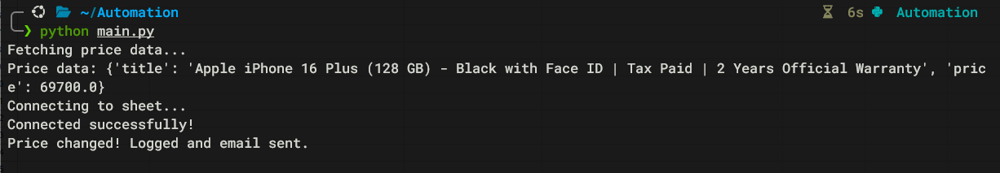
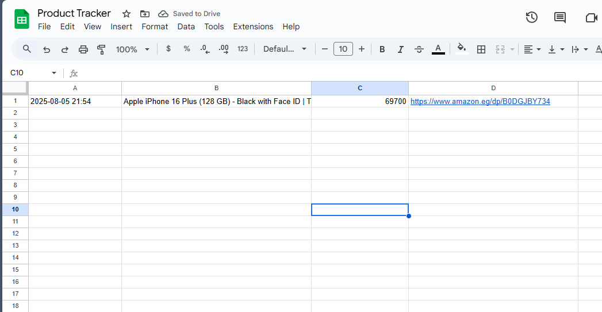
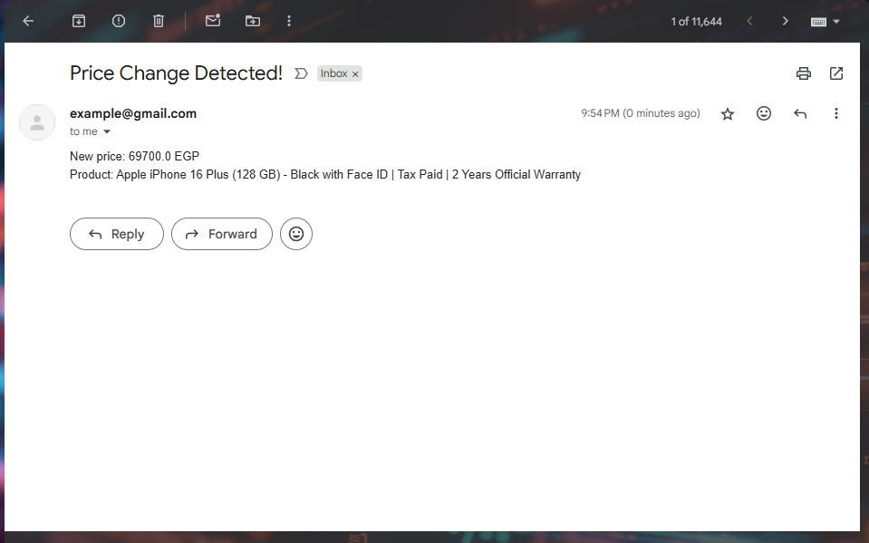

# Amazon Price Tracker 🛒📊

An automated Python script that monitors Amazon product prices, logs changes to Google Sheets, and sends email alerts when prices change.

## Features ✨

- **Automated Price Monitoring**: Checks Amazon product prices on schedule or demand
- **Google Sheets Integration**: Automatically logs price history with timestamps
- **Email Notifications**: Sends alerts when price changes are detected
- **Arabic Text Support**: Handles Arabic product titles and currency formatting
- **Error Handling**: Robust error handling for network issues and data parsing
- **Scheduled Execution**: Can be automated with cron jobs or task schedulers

## How It Works 🔄

This script performs the following steps:
1. **Scrapes** the specified Amazon product page
2. **Compares** current price with last recorded price
3. **Logs** price changes to Google Sheets with timestamp
4. **Sends** email notification if price has changed
5. **Runs** on-demand or via scheduled automation

## Setup Instructions 📋

### 1. Clone the Repository
```bash
git clone <your-repo-url>
cd Automation
```

### 2. Install Dependencies
```bash
pip install -r requirements.txt
```

### 3. Google Cloud & Sheets API Setup 🔧
#### Step 3.1: Create Google Cloud Project
1. Go to [Google Cloud Console](https://console.cloud.google.com/)
2. Click "New Project" → Enter project name → Create
3. Select your newly created project

#### Step 3.2: Enable Required APIs
1. **Enable Google Sheets API**: 
   - Visit: https://console.developers.google.com/apis/api/sheets.googleapis.com/overview
   - Click "Enable"
2. **Enable Google Drive API**: 
   - Visit: https://console.developers.google.com/apis/api/drive.googleapis.com/overview
   - Click "Enable"

#### Step 3.3: Create Service Account
1. Go to [Credentials Page](https://console.cloud.google.com/apis/credentials)
2. Click "Create Credentials" → "Service Account"
3. Enter service account name → Create
4. Skip optional steps → Done
5. Click on the created service account
6. Go to "Keys" tab → "Add Key" → "Create New Key" → JSON
7. Download the JSON file and rename it to `credentials.json`
8. Place `credentials.json` in your project root folder


#### Step 3.4: Create Google Sheet
1. Go to [Google Sheets](https://sheets.google.com)
2. Create new sheet named **"Product Tracker"**
3. Add headers in first row: `Date | Product | Price | URL`
4. Click "Share" button
5. Add your service account email (from credentials.json): `your-service-account@your-project.iam.gserviceaccount.com`
6. Give "Editor" permissions → Send


### 4. Gmail App Password Setup 📧

#### Step 4.1: Enable 2-Factor Authentication
1. Go to [Google Account Security](https://myaccount.google.com/security)
2. Click "2-Step Verification" → Follow setup instructions

#### Step 4.2: Generate App Password
1. Go to [App Passwords](https://myaccount.google.com/apppasswords)
2. Select app: "Mail"
3. Select device: "Other (custom name)"
4. Enter name: "Amazon Price Tracker"
5. Click "Generate"
6. **Copy the 16-character password** (format: `xxxx xxxx xxxx xxxx`)
7. **Important**: Do not use your regular Gmail password here, use the generated app password instead.

#### Step 4.3: Update Email Configuration
Update `emailalert.py` with your credentials:
```python
sender = 'your-email@gmail.com'        # Your Gmail address
password = 'xxxxxxxxxxxxxx'            # 16-character app password (no spaces)
```

### 5. Configure Product URL
Update the Amazon product URL in `main.py`:
```python
url = 'https://www.amazon.eg/dp/YOUR-PRODUCT-ID'
email = 'recipient@gmail.com'  # Email to receive alerts
```

## Quick Setup Links 🔗

### Google Cloud Setup:
- [Create New Project](https://console.cloud.google.com/projectcreate)
- [Enable Sheets API](https://console.developers.google.com/apis/api/sheets.googleapis.com/overview)
- [Enable Drive API](https://console.developers.google.com/apis/api/drive.googleapis.com/overview)
- [Create Service Account](https://console.cloud.google.com/apis/credentials/serviceaccountkey)

### Gmail Setup:
- [Account Security](https://myaccount.google.com/security)
- [App Passwords](https://myaccount.google.com/apppasswords)

### Google Sheets:
- [Create New Sheet](https://sheets.google.com)

## Usage 💻

### Manual Execution
```bash
python main.py
```



### Automated Scheduling (Linux/WSL)
Check prices every hour:
```bash
crontab -e
# Add this line:
0 * * * * cd /path/to/your/project && python main.py
```

### Automated Scheduling (Windows)
Use Task Scheduler to run the script at desired intervals.

## Results 📊

### Google Sheets Price History


### Email Notifications


## File Structure 📁

```
Automation/
├── main.py              # Main execution script
├── amazon.py            # Amazon scraping logic
├── gsheets.py           # Google Sheets integration
├── emailalert.py        # Email notification system
├── credentials.json     # Google API credentials (you create this)
├── requirements.txt     # Python dependencies
├── README.md           # Project documentation
└── images/             # Screenshots and demo images
    ├── cli.png
    ├── sheet.png
    └── email.png
```

## Sample Output 📋

```
Fetching price data...
Price data: {'title': 'ابل موبايل ايفون 16 بلس...', 'price': 69700.0}
Connecting to sheet...
Connected successfully!
Price changed! Logged and email sent.
```

## Troubleshooting 🔧

### Common Issues:

1. **SpreadsheetNotFound Error**:
   - Ensure sheet name matches exactly: "Product Tracker"
   - Check service account has access to the sheet

2. **APIError [403]**:
   - Enable both Sheets and Drive APIs
   - Wait 2-3 minutes after enabling APIs

3. **SMTPAuthenticationError**:
   - Use App Password, not regular Gmail password
   - Enable 2-Factor Authentication first

4. **UnicodeEncodeError**:
   - Already handled with UTF-8 encoding in current version

### Customization Options:
- Multiple product monitoring
- Price threshold alerts
- Custom email templates
- WhatsApp/Telegram notifications
- Dashboard integration

## Disclaimer ⚠️

This tool is for educational and personal use. Please respect Amazon's robots.txt and terms of service. Use responsibly and consider implementing proper delays between requests.